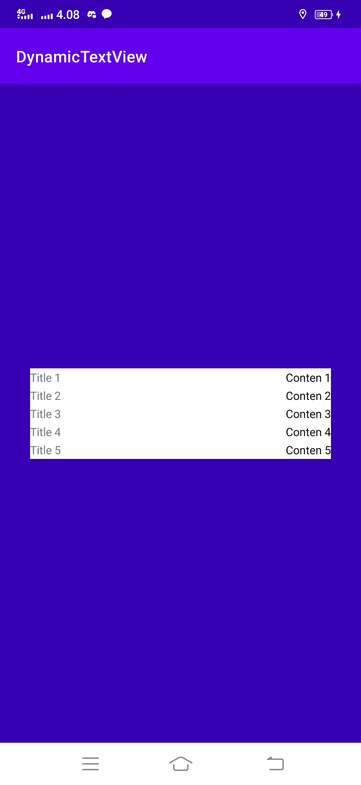

# DynamicTextView

<pre>

</pre>

```java
public class MainActivity extends AppCompatActivity {

    @Override
    protected void onCreate(Bundle savedInstanceState) {
        super.onCreate(savedInstanceState);
        setContentView(R.layout.activity_main);

        sample1();
    }

    private void sample1() {
        ArrayList<DynamicTextView.TextViewItem> textViewItems = new ArrayList<>();

        textViewItems.add(new DynamicTextView.TextViewItem("Title 1", "Conten 1"));
        textViewItems.add(new DynamicTextView.TextViewItem("Title 2", "Conten 2"));
        textViewItems.add(new DynamicTextView.TextViewItem("Title 3", "Conten 3"));
        textViewItems.add(new DynamicTextView.TextViewItem("Title 4", "Conten 4"));
        textViewItems.add(new DynamicTextView.TextViewItem("Title 5", "Conten 5"));

        LinearLayout parent = findViewById(R.id.parent);

        new DynamicTextView(getApplicationContext(), parent, R.layout.item_dynamic_textview)
                .setList(textViewItems)
                .build();
    }
}
```


---

```
Copyright 2022 M. Fadli Zein
```